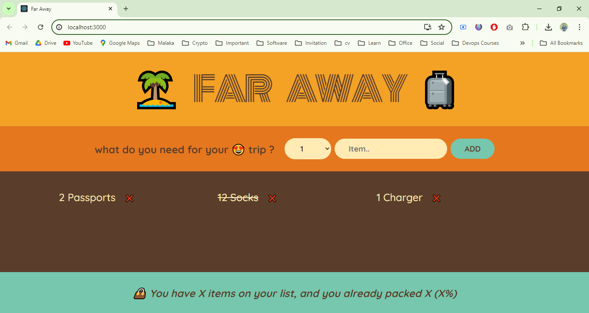
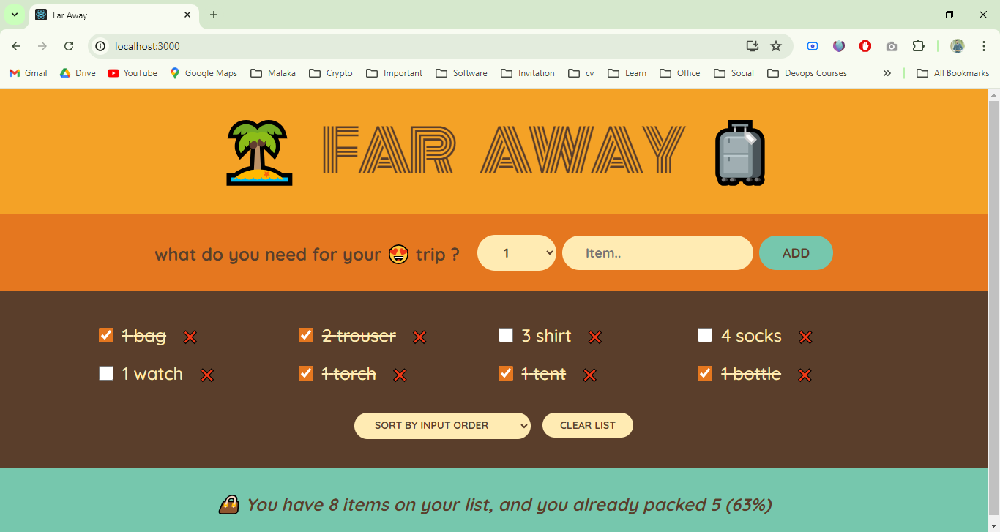

# Far Away React App

In the project directory, you can run:

### `npm start`

Runs the app in the development mode.\
Open [http://localhost:3000](http://localhost:3000) to view it in your browser.

#### Project View
 version 1 

 version 2 

